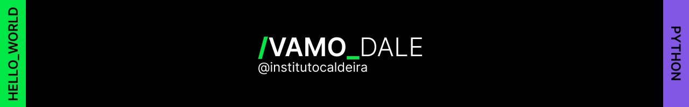

# sabor_express

## Ferramentas utilizadas:

* Front-end

* Javascript

## Feito por:

### Adam Kenzo

### Instagram: [https://www.instagram.com/adamkenz0/]

### LinkedIn: [https://www.linkedin.com/in/adam-kenzo-isa-bezerra-a08158278/]

## Certificados do curso: 

### Lógica de programação: praticando com desafios - [https://cursos.alura.com.br/certificate/adamkisa/logica-programacao-praticando-desafios]

## O que eu aprendi: 

* Analisar o código de uma página HTML para entender sua estrutura e planejar o código de sua funcionalidade;

* Recuperar elementos da página com JavaScript, com o uso das funções document.querySelector() e document.getElementById();

* Declarar variáveis no JavaScript para armazenar elementos recuperados da página;

* Acessar a lista de classes que um elemento da página possui, via propriedade classList;

* Verificar se um elemento da página possui uma determinada classe CSS, via função classList.contains();

* Remover uma classe CSS de um elemento da página, via função classList.remove();

* Adicionar uma classe CSS a um elemento da página, via função classList.add();

* Alterar o texto de um elemento da página, via propriedade textContent;

* Declarar um bloco condicional if/else, para implementar a funcionalidade de alterar o status de um jogo.

## Créditos do footer-readme: [@ambosdev](https://github.com/ambosdev)

###### Repositório criado para um dos projetos realizados através do programa sem fins lucrativos do [@Instituto Caldeira](https://www.instagram.com/institutocaldeira) na trilha de Python!
### Conteúdo didático disponibilizado no programa:
- [x] Lógica de Programação com JavaScript
- [x] Linguagem Python orientada a objetos + API
- [x] Variáveis, arrays, coleções e estruturas de controle

`JavaScript` `Python`
#### #ETERNOJEAN
